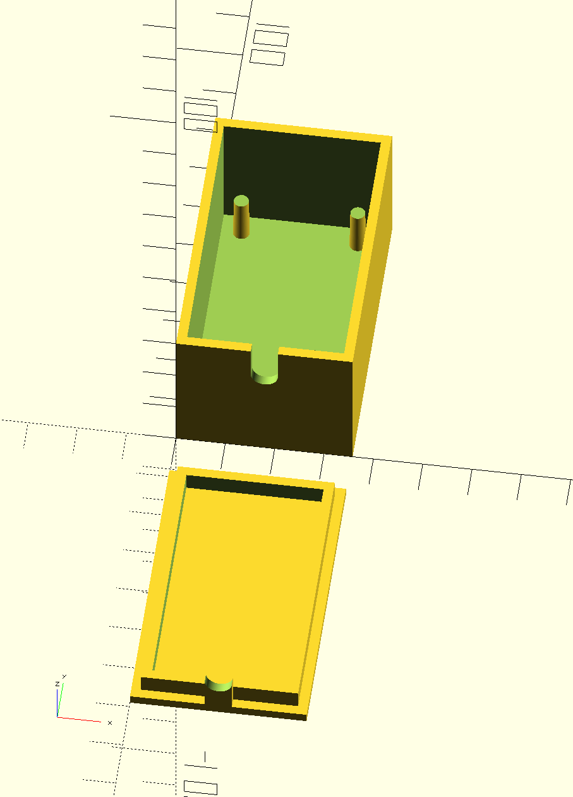
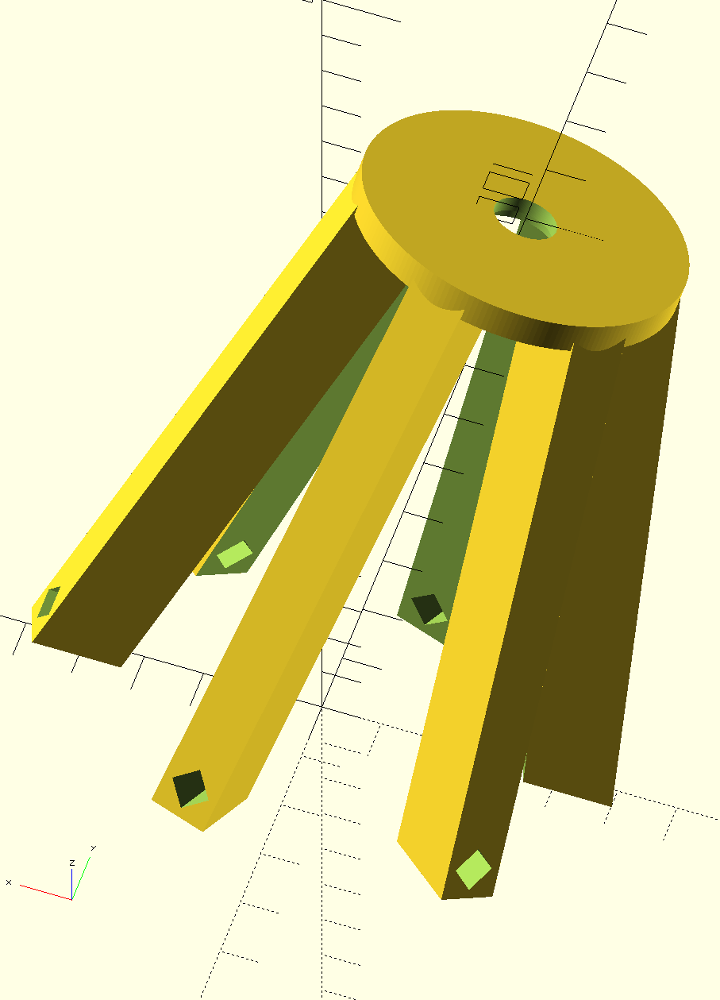
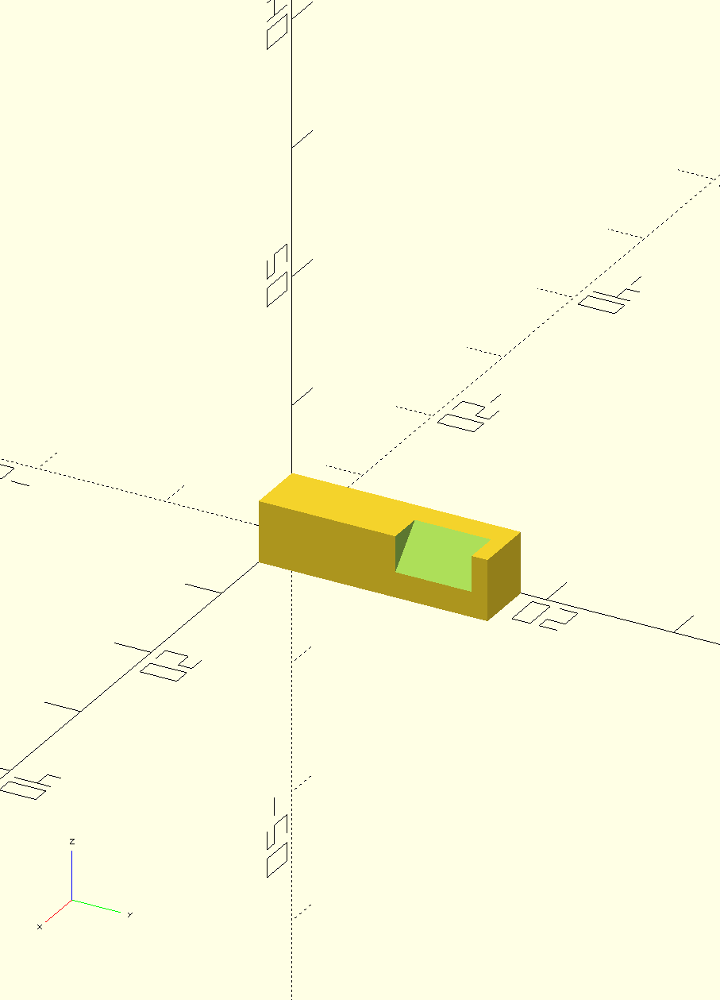

# Vicleby Mod Project
This folder contains 3d models for modifying Ikea Vicleby lamp by replacing standard light bulb with addressable led strips controlled by ESP32 with WLED firmware.

ESP32 enclosure:

Support for the central tube:

Part of support (hook):

